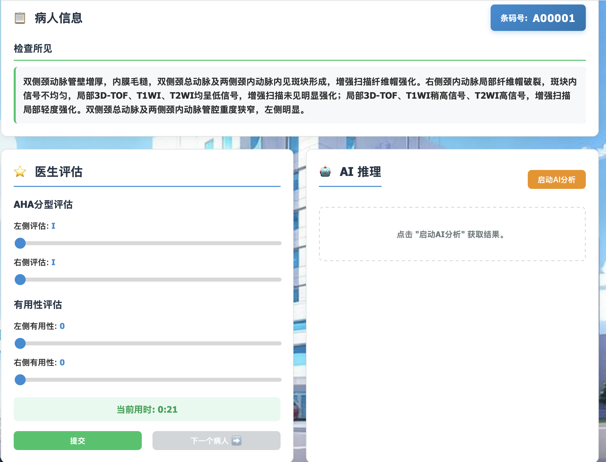

# AHA UI - Medical Plaque Classification Interface

A web-based user interface for the AHA (American Heart Association) automated plaque classification system, designed for medical professionals to label MRI carotid artery plaque images with AHA classifications.



## Features

- **Multi-user Support**: Multiple users can login and track their labeling progress independently
- **AI-assisted Classification**: Provides AI inference suggestions based on examination findings
- **Real-time Timer**: Tracks time spent per patient evaluation
- **Progress Tracking**: User progress saved to JSON files for continuity
- **Excel Export**: Export labeled data back to Excel format
- **Roman Numeral Interface**: AHA classifications I-VIII with intuitive slider controls

## Quick Start

### Development Mode (Single-threaded, for debugging)
```bash
python app.py
```
Server runs on http://127.0.0.1:5001

### Production Mode (Multi-threaded, recommended)
```bash
python run_production.py
```
Uses Waitress WSGI server with 4 concurrent threads on http://0.0.0.0:5001

### Installation
```bash
pip install -r requirements.txt
```

## Architecture

### Backend (Flask)
- **Main application**: `app.py`
- **Session management**: In-memory user sessions
- **Data persistence**: User progress saved to `user_data/` directory
- **AI integration**: OpenAI-compatible API with configuration from parent project
- **Validation**: Pydantic models for AI response validation

### Frontend (Vue.js)
- **HTML**: `static/index.html`
- **JavaScript**: `static/js/app.js` (Vue 3)
- **CSS**: `static/css/style.css`
- **Framework**: Vue.js 3 via CDN, Axios for HTTP requests

### Data Flow
1. User logs in → loads Excel data and existing progress
2. Display current patient's examination findings
3. User can:
   - Call AI for classification suggestions
   - Manually adjust AHA assessments (I-VIII)
   - Mark consistency/usefulness
   - Submit evaluation (saves with timestamp)
   - Navigate patients or jump to specific barcode
4. Export generates Excel with merged labels

## Configuration

### Required Paths
- Excel data source: `/mnt/f/Project/AHA_LLM-main/aha_llm/pre_excel/aha_pri_try.xlsx`
- User data directory: `./user_data/`
- API config: `../api_config.json`
- System prompt: `prompt_9.md`

### API Configuration
Loads from parent project's `api_config.json`:
- Automatically selects first enabled API with valid key
- Supports: SiliconFlow, Google AI Studio, Alibaba Qianfan, OpenRouter, local deployments
- Configurable: model, temperature, max_tokens, timeout

## AHA Classification System

Types I-VIII based on American Heart Association MRI plaque classification:
- **I-II**: Near-normal wall thickening
- **III**: Diffuse intimal thickening/small eccentric plaque
- **IV-V**: Plaque with lipid/necrotic core
- **VI**: Complex plaque with surface defects/hemorrhage
- **VII**: Calcified plaque
- **VIII**: Fibrous plaque without lipid core

## Multi-User Support

- ✅ Independent user sessions and progress
- ✅ Concurrent logins and AI inference
- ✅ Thread-safe file storage
- ⚠️ Shared API client (rate limit considerations)
- ⚠️ In-memory sessions (lost on server restart)

**Recommended usage**: 5-20 users in production mode

## Testing

Use the mock endpoint `/api/infer/test` for frontend testing without API credits:
```bash
curl http://localhost:5001/api/infer/test
```

## Dependencies

- flask
- flask-cors
- pandas
- openpyxl
- openai
- pydantic
- waitress (production)

## License

Part of the AHA_LLM project for medical image classification research.