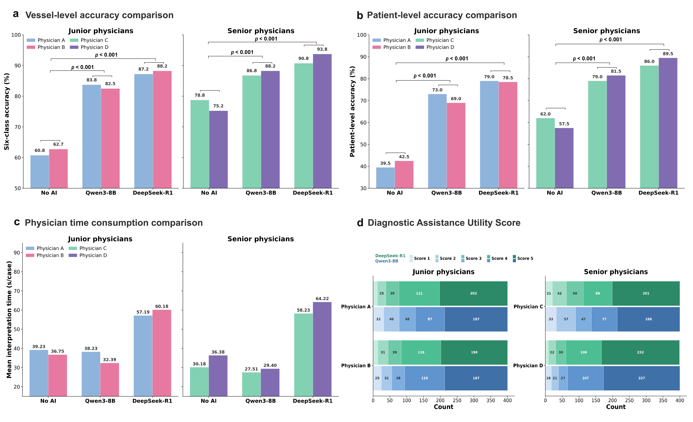

<div align="center">

# Large Language Model Assistance for Report-Based Carotid Plaque AHA Classification

### Multicenter Reader Study

[](https://opensource.org/licenses/MIT)
[](https://www.python.org/downloads/)
[](https://www.docker.com/)

**[中文文档](README_CN.md)** ·
**[Paper](#citation)**

[](https://demo.scosine.org)

</div>

---

## Abstract

Carotid atherosclerotic plaque rupture is a leading cause of ischemic stroke. The modified American Heart Association (AHA) classification based on high-resolution magnetic resonance imaging (HRMRI) enables risk stratification beyond stenosis degree. However, inferring standardized AHA classification from free-text reports is cognitively demanding and highly experience-dependent.

We propose **Criteria-Guided Prompting (CGP)**, which explicitly embeds the modified AHA classification criteria into LLM prompts, decomposing the task into two auditable steps — mapping signal descriptions to plaque components, then applying hierarchical criteria to assign the final type. This multicenter reader study includes **433 patients (866 carotid vessels)** from three institutions.

<div align="center">


**Figure 2.** Overall study workflow and experimental design. **(a)** Reference standard establishment. **(b)** Standalone AI performance evaluation comparing a rule-based baseline against 10 LLMs under naive and criteria-guided prompting. **(c)** Human–AI collaboration reader study with a randomized crossover design and 6-week washout period.

</div>

---

## Key Results

<table>
<tr>
<td width="50%" valign="top">

### Six-Class Classification

| Model | Accuracy |
|:------|:--------:|
| DeepSeek-R1 (CGP) | **87.41%** |
| Qwen3-235B-Instruct (CGP) | 85.57% |
| GLM-4.5 (CGP) | 85.45% |
| Qwen3-8B (CGP) | 81.52% |

**Qwen3-8B** improved from 38.91% to **81.52%** (+42.6 pp) with criteria-guided prompting.

</td>
<td width="50%" valign="top">

### Binary Classification (AUC)

| Task | Best Model | AUC |
|:-----|:-----------|:---:|
| Advanced Lesion Detection (III–VIII vs Normal/I–II) | GLM-4.5 | **0.992** |
| Type VI Complex Plaque Detection (VI vs non-VI) | DeepSeek-R1 | **0.950** |

</td>
</tr>
</table>

### Clinical Validation (Reader Study, n=4 radiologists)

| Condition | Accuracy | Weighted κ |
|:----------|:--------:|:----------:|
| Without AI | 69.38% | 0.231 |
| With DeepSeek-R1 | **90.00%** | **0.775** |

- Junior physicians: **+26 pp** improvement
- Senior physicians: **+15 pp** improvement

<div align="center">



**Figure 3.** Reader study performance with AI assistance. **(a)** Vessel-level and **(b)** patient-level six-class accuracy for junior and senior radiologists under three conditions: no AI, Qwen3-8B assistance, and DeepSeek-R1 assistance. **(c)** Mean interpretation time per case. **(d)** Distribution of Diagnostic Assistance Utility Score (DAUS). AI assistance improved accuracy with larger gains in junior radiologists.

</div>

---

## Methodology

### Criteria-Guided Prompting (CGP)

CGP explicitly embeds the modified AHA classification criteria into LLM prompts, guiding models through a two-step auditable reasoning process:

**Step 1: Signal-to-Component Mapping**
- T1WI/T2WI signal patterns → Tissue composition (lipid core, fibrous tissue, calcification)
- Morphological features → Surface characteristics (ulceration, thrombosis)
- Enhancement patterns → Tissue vascularity and inflammation

**Step 2: Hierarchical Criteria Application**
- Apply predefined classification rules in priority order to assign the final AHA type
- Generate structured reasoning chains for clinical review

This approach aligns model outputs with established clinical rules without requiring fine-tuning or external knowledge bases.

---

## Modified AHA Classification

| Type | Description | MRI Characteristics |
|:----:|:------------|:--------------------|
| **I-II** | Near-normal wall thickening | Minimal wall thickness increase |
| **III** | Diffuse intimal thickening / small eccentric plaque | Early plaque without lipid core |
| **IV-V** | Plaque with lipid/necrotic core | T2WI low signal core, no hemorrhage |
| **VI** | Complex plaque with hemorrhage/thrombosis | Surface rupture, IPH (T1WI high signal) |
| **VII** | Calcified plaque | T1/T2 extremely low signal (signal void) |
| **VIII** | Fibrous plaque without lipid core | T2WI isointense, homogeneous enhancement |

> **Clinical Significance**: Type VI (complex plaques with IPH) increases ischemic risk by 5-6 fold.

---

## Installation

### Prerequisites

- Python 3.8+
- NVIDIA GPU (for local LLM deployment, optional)

### Local Development

```bash
# Clone repository
git clone https://github.com/your-repo/LLMAHA_Web.git
cd LLMAHA_Web

# Install dependencies
pip install -r requirements.txt

# Configure API (copy and edit)
cp api_config.example.json api_config.json

# Run server
python app.py
# Server runs at http://127.0.0.1:7860
```

### Docker Deployment

```bash
# Build and run
docker build -t aha-classifier .
docker run -p 7860:7860 \
  -e API_KEY=your-api-key \
  -e API_BASE_URL=https://api.example.com/v1 \
  -e API_MODEL=model-name \
  aha-classifier
```

---

## Environment Variables

| Variable | Description | Default |
|:---------|:------------|:--------|
| `API_KEY` | LLM API key | - |
| `API_BASE_URL` | API endpoint URL | - |
| `API_MODEL` | Model name | - |
| `API_MAX_TOKENS` | Maximum tokens | 4096 |
| `API_TEMPERATURE` | Sampling temperature | 0.1 |

---

## Local LLM Deployment (vLLM)

The `deploy/` directory contains Docker Compose configurations for deploying models locally with vLLM:

```
deploy/
├── qwen3_8b/           # Qwen3-8B (recommended for efficiency)
├── deepseek-r1/        # DeepSeek-R1 (highest accuracy)
├── deepseek-v3/
├── glm-4.5/
├── qwen3_235b_instruct/
├── qwen3_235b_thinking/
└── ...
```

**Deploy Qwen3-8B locally:**

```bash
cd deploy/qwen3_8b

# Configure environment
export MODEL_DIR=/path/to/qwen3_8b_weights
export VLLM_API_KEY=your-secret-key
export CUDA_VISIBLE_DEVICES=0

# Start service
docker-compose up -d

# Service available at http://localhost:9002
```

Then configure your `api_config.json`:

```json
{
  "api_configs": [{
    "name": "qwen3-8b-local",
    "base_url": "http://localhost:9002/v1",
    "api_key": "your-secret-key",
    "model": "qwen3_8b",
    "enabled": true
  }],
  "use_name": "qwen3-8b-local"
}
```

---

## Live Demo

Try the interactive demo on Hugging Face Spaces:

[](https://demo.scosine.org)

---

## Citation

```bibtex
@article{cgp-aha-2026,
  title={Large Language Model Assistance for Report-Based Carotid Plaque
         AHA Classification: Multicenter Reader Study},
  author={...},
  journal={Insights into Imaging},
  year={2026}
}
```

---

## License

This project is licensed under the MIT License.
