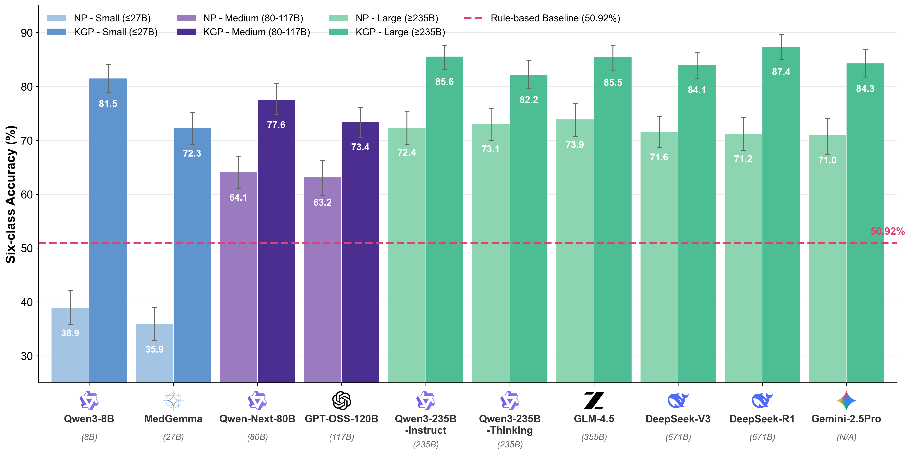

<div align="center">

# 基于知识引导的大语言模型实现颈动脉斑块改良AHA自动分型

### 多中心验证研究

[](https://opensource.org/licenses/MIT)
[](https://www.python.org/downloads/)
[](https://www.docker.com/)

**[English](README.md)** ·
**[在线演示](https://huggingface.co/spaces/your-space)** ·
**[论文](#引用)**

</div>

---

## 摘要

颈动脉粥样硬化斑块破裂是缺血性卒中的主要原因。基于高分辨率磁共振成像（HRMRI）的改良美国心脏协会（AHA）分型系统可实现超越狭窄程度的风险分层。然而，从自由文本报告中进行人工分型耗时且阅片者间一致性欠佳。

我们提出**知识引导提示（KGP）**，将结构化分类标准嵌入LLM提示词中，实现准确的自动分类和可追溯的推理链。本多中心验证研究纳入了来自三家医疗中心的**433例患者（866条颈动脉）**。

<div align="center">


**图1.** 研究设计和知识引导提示框架

</div>

---

## 核心结果

<table>
<tr>
<td width="50%" valign="top">

### 六分类准确率

| 模型 | 准确率 |
|:------|:--------:|
| DeepSeek-R1 (KGP) | **87.41%** |
| Qwen3-235B-Instruct (KGP) | 85.57% |
| GLM-4.5 (KGP) | 85.45% |
| Qwen3-8B (KGP) | 81.52% |

**Qwen3-8B** 在知识引导下从38.91%提升至**81.52%**（+42.6 pp）

</td>
<td width="50%" valign="top">

### 二分类性能（AUC）

| 任务 | 最佳模型 | AUC |
|:-----|:-----------|:---:|
| 显著斑块检测（III-VIII型） | GLM-4.5 | **0.992** |
| VI型复杂斑块检测 | DeepSeek-R1 | **0.950** |

</td>
</tr>
</table>

### 临床验证（多阅片者研究，n=4名放射科医师）

| 条件 | 准确率 | 加权κ |
|:----------|:--------:|:----------:|
| 无AI辅助 | 69.38% | 0.231 |
| DeepSeek-R1辅助 | **90.00%** | **0.775** |

- 初级医师：**+26 pp** 提升
- 高级医师：**+15 pp** 提升

<div align="center">



**图2.** 各模型六分类改良AHA分型性能对比

</div>

---

## 方法学

### 知识引导提示（KGP）

KGP将结构化分类标准直接嵌入提示词中，引导LLM通过两步推理过程：

**步骤1：信号到成分映射**
- T1WI/T2WI信号模式 → 组织成分（脂质核心、纤维组织、钙化）
- 形态学特征 → 表面特征（溃疡、血栓）
- 强化模式 → 组织血管化和炎症

**步骤2：成分到类型分配**
- 基于主要病理特征综合识别的成分
- 应用鉴别标准确定最终AHA分型

该方法提供了一种轻量级的RAG替代方案，无需外部基础设施。

---

## 改良AHA分型

| 类型 | 描述 | MRI特征 |
|:----:|:------------|:--------------------|
| **I-II** | 接近正常的管壁增厚 | 管壁厚度轻微增加 |
| **III** | 弥漫性内膜增厚/小偏心性斑块 | 无脂质核心的早期斑块 |
| **IV-V** | 含脂质/坏死核心的斑块 | T2WI低信号核心，无出血 |
| **VI** | 伴出血/血栓的复杂斑块 | 表面破裂，斑块内出血（T1WI高信号） |
| **VII** | 钙化斑块 | T1/T2极低信号（信号消失） |
| **VIII** | 无脂质核心的纤维斑块 | T2WI等信号，均匀强化 |

> **临床意义**：VI型（伴斑块内出血的复杂斑块）使缺血风险增加5-6倍。

---

## 安装部署

### 环境要求

- Python 3.8+
- NVIDIA GPU（本地部署LLM时需要，可选）

### 本地开发

```bash
# 克隆仓库
git clone https://github.com/your-repo/LLMAHA_Web.git
cd LLMAHA_Web

# 安装依赖
pip install -r requirements.txt

# 配置API（复制并编辑）
cp api_config.example.json api_config.json

# 启动服务器
python app.py
# 服务器运行在 http://127.0.0.1:7860
```

### Docker部署

```bash
# 构建并运行
docker build -t aha-classifier .
docker run -p 7860:7860 \
  -e API_KEY=your-api-key \
  -e API_BASE_URL=https://api.example.com/v1 \
  -e API_MODEL=model-name \
  aha-classifier
```

---

## 环境变量配置

| 变量 | 说明 | 默认值 |
|:---------|:------------|:--------|
| `API_KEY` | LLM API密钥 | - |
| `API_BASE_URL` | API端点URL | - |
| `API_MODEL` | 模型名称 | - |
| `API_MAX_TOKENS` | 最大令牌数 | 4096 |
| `API_TEMPERATURE` | 采样温度 | 0.1 |

---

## 本地LLM部署（vLLM）

`deploy/` 目录包含使用vLLM在本地部署模型的Docker Compose配置：

```
deploy/
├── qwen3_8b/           # Qwen3-8B（推荐用于效率优化）
├── deepseek-r1/        # DeepSeek-R1（最高准确率）
├── deepseek-v3/
├── glm-4.5/
├── qwen3_235b_instruct/
├── qwen3_235b_thinking/
└── ...
```

**本地部署Qwen3-8B：**

```bash
cd deploy/qwen3_8b

# 配置环境变量
export MODEL_DIR=/path/to/qwen3_8b_weights
export VLLM_API_KEY=your-secret-key
export CUDA_VISIBLE_DEVICES=0

# 启动服务
docker-compose up -d

# 服务地址 http://localhost:9002
```

然后配置 `api_config.json`：

```json
{
  "api_configs": [{
    "name": "qwen3-8b-local",
    "base_url": "http://localhost:9002/v1",
    "api_key": "your-secret-key",
    "model": "qwen3_8b",
    "enabled": true
  }],
  "use_name": "qwen3-8b-local"
}
```

---

## 在线演示

在Hugging Face Spaces上试用交互式演示：[演示链接](https://huggingface.co/spaces/your-space)

---

## 引用

```bibtex
@article{kgp-aha-2025,
  title={Knowledge-Guided Large Language Models for Automated Modified AHA
         Classification of Carotid Plaque from Free-Text MRI Reports:
         A Multicenter Validation Study},
  author={...},
  journal={...},
  year={2025}
}
```

---

## 许可证

本项目采用 MIT 许可证。
