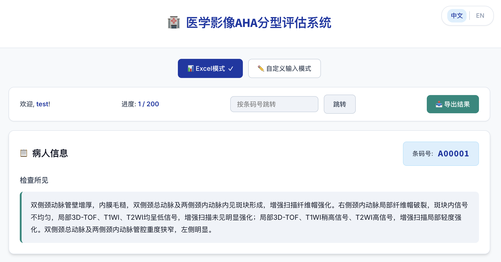
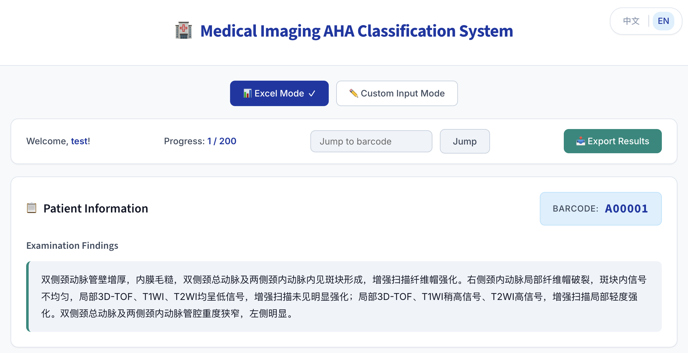
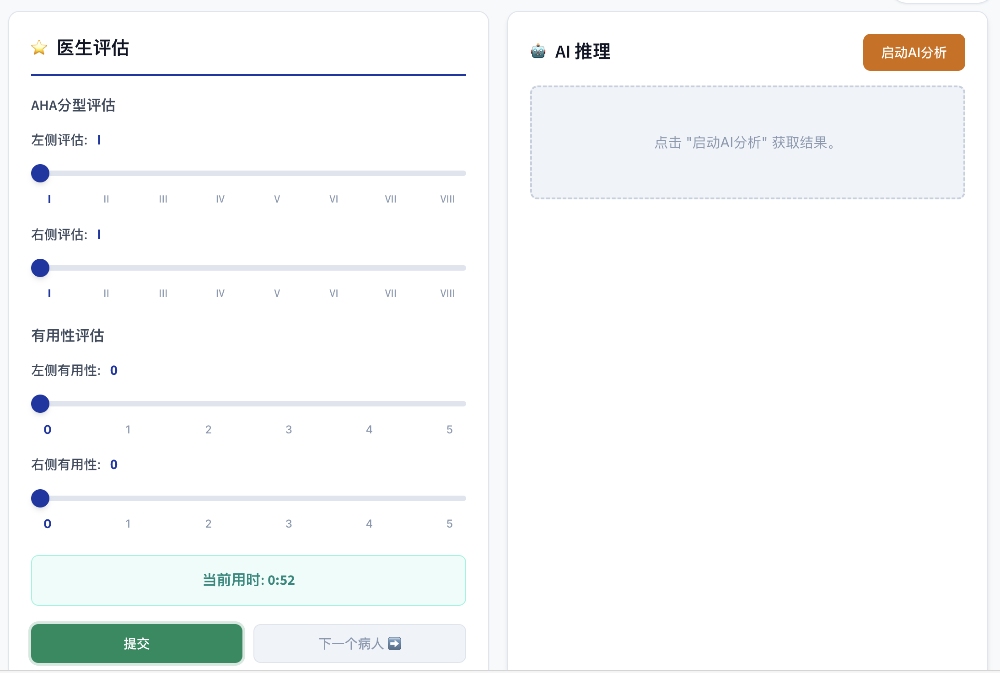
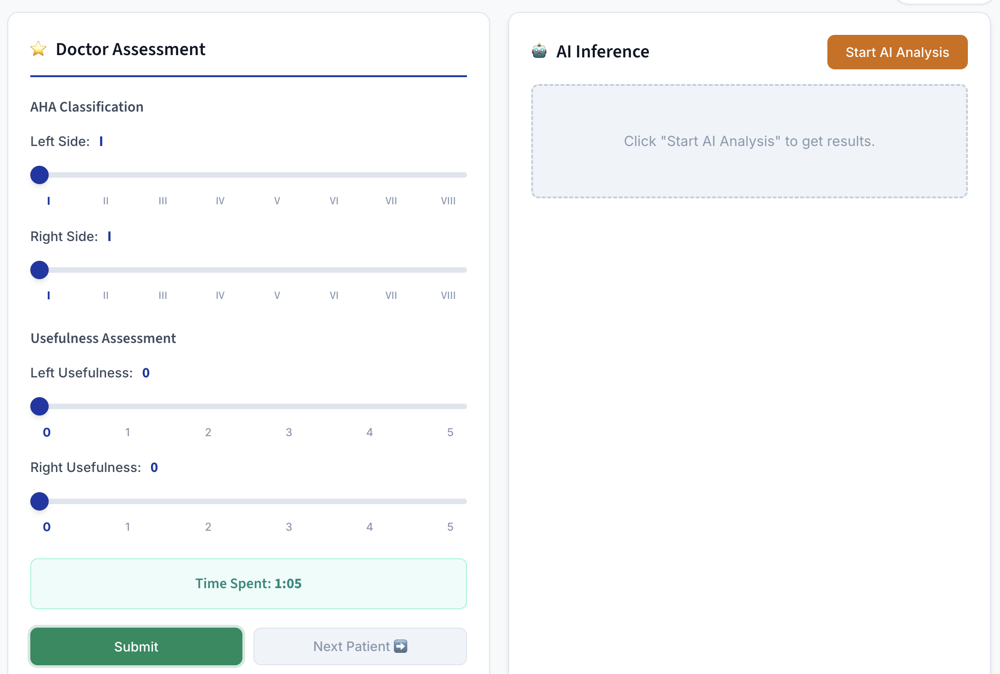

# AHA UI - 医学影像AHA分型评估系统

基于美国心脏协会（AHA）斑块分型标准（I-VIII型）的MRI颈动脉斑块AI辅助分类Web界面。

[English](README.md)

## 功能特点

- **双语界面**：完整的中英文支持，一键切换
- **双输入模式**：Excel批量模式和自定义输入模式，灵活的数据录入方式
- **AI辅助分类**：基于大语言模型的推理，输出结构化AHA分型结果
- **多用户支持**：独立的用户进度跟踪，JSON持久化存储
- **实时计时器**：记录每位患者的评估时间，便于工作流分析
- **Excel导出**：导出所有评估结果（Excel模式和自定义模式）

## 界面截图

| 登录页面 | 病人信息（中文） | 病人信息（英文） |
|:---:|:---:|:---:|
|  |  |  |

| 医生评估（中文） | 医生评估（英文） | 自定义输入模式 |
|:---:|:---:|:---:|
|  |  |  |

## 项目结构

```
LLMAHA_Web/
├── app.py                  # Flask后端应用
├── run_production.py       # 生产环境服务器（Waitress WSGI）
├── requirements.txt        # Python依赖
├── api_config.json         # API配置文件（从示例创建）
├── api_config_example.json # API配置模板
├── prompt_9.md             # AI系统提示词（AHA分类）
├── test200.xlsx            # 示例患者数据（Excel格式）
├── static/
│   ├── index.html          # 前端主页面
│   ├── js/
│   │   └── app.js          # Vue.js 3应用（含国际化）
│   └── css/
│       └── style.css       # UI样式
├── user_data/              # 用户进度目录（自动创建）
│   ├── {用户名}.json        # Excel模式评估进度
│   └── {用户名}_custom.json # 自定义模式评估
└── fig/                    # 文档截图
```

## 部署指南

### 1. 环境要求

- Python 3.8+
- pip 包管理器

### 2. 克隆并安装依赖

```bash
git clone <repository-url>
cd LLMAHA_Web
uv pip install -r requirements.txt # 没有uv也可以就用pip
```

依赖包：
- flask
- flask-cors
- pandas
- openpyxl
- openai
- pydantic
- waitress

### 3. 配置API

复制并编辑API配置文件：

```bash
cp api_config_example.json api_config.json
```

编辑 `api_config.json` 添加您的LLM API凭据：

```json
{
  "api_configs": [
    {
      "name": "api名称",
      "base_url": "https://api.example.com/v1",
      "api_key": "您的API密钥",
      "model": "模型名称",
      "max_tokens": 2000,
      "temperature": 0.3,
      "timeout": 30,
      "enabled": true
    }
  ],
  "use_name": "api名称"
}
```

**支持的API提供商：**
- OpenAI / OpenAI兼容API
- 硅基流动 (SiliconFlow)
- DeepSeek
- 本地LLM部署 (Ollama, vLLM等)

### 4. 准备数据文件

将患者数据Excel文件放置在项目根目录。文件必须包含：
- `条码号` 列：患者标识符
- `检查所见` 列：MRI检查所见文本

默认文件路径：`test200.xlsx`

如需更改数据文件路径，请编辑 `app.py` 中的 `TABLE_PATH`（第147行）。

### 5. 启动服务器

**开发模式**（单线程，带调试）：
```bash
python app.py
# 服务运行在 http://127.0.0.1:5001
```

**生产模式**（多线程，推荐）：
```bash
python run_production.py
# 服务运行在 http://0.0.0.0:5001
```

生产模式使用Waitress WSGI服务器：
- 4个并发线程
- 60秒通道超时（适应AI推理时间）
- 可从网络访问（0.0.0.0）

## 使用教程

### 步骤1：登录

1. 打开浏览器访问 `http://localhost:5001`
2. 输入用户名（任意字符串，用于进度跟踪）
3. 点击"登录"按钮

### 步骤2：选择输入模式

- **Excel模式**：从Excel数据文件顺序加载患者
- **自定义输入模式**：手动输入检查所见进行即时分析

### 步骤3：查看患者信息

在Excel模式下：
- 查看当前患者的条码号和检查所见
- 使用"上一个/下一个"按钮导航
- 输入条码号可跳转到指定患者
- 进度指示器显示当前位置（如"1/200"）

### 步骤4：AI辅助分类

1. 点击"启动AI分析"按钮
2. 等待大语言模型分析检查所见
3. 查看AI的推理过程和建议的AHA分型

### 步骤5：医生评估

1. 调整左右侧颈动脉的AHA分型滑块（I-VIII）
2. 评价AI有用性（0-5分）
3. 计时器自动记录当前患者的评估时间

### 步骤6：提交并导航

1. 点击"提交"保存评估结果
2. 点击"下一个病人"继续下一例
3. 进度自动保存到 `user_data/{用户名}.json`

### 步骤7：导出结果

点击"导出结果"下载Excel文件，包含：
- 工作表1（Excel评估）：Excel模式评估及所有患者数据
- 工作表2（自定义评估）：自定义模式评估记录（如有）

## AHA分型参考

| 分型 | 描述 | MRI特征 |
|:---:|:---|:---|
| I-II | 近正常管壁增厚 | 变化轻微 |
| III | 弥漫性内膜增厚/小偏心斑块 | 早期斑块形成 |
| IV-V | 含脂质/坏死核心斑块 | T2WI低信号，无出血 |
| VI | 复杂斑块伴出血/血栓 | 表面缺损，斑块内出血 |
| VII | 钙化斑块 | T1/T2极低信号 |
| VIII | 无脂质核心的纤维斑块 | T2WI等信号，有强化 |

## API接口

| 接口 | 方法 | 描述 |
|:---|:---:|:---|
| `/api/login` | POST | 用户登录，加载Excel数据 |
| `/api/patient/navigate` | POST | 导航到上/下一个患者 |
| `/api/patient/jump` | POST | 跳转到指定条码号 |
| `/api/submit` | POST | 提交评估（Excel模式） |
| `/api/custom/submit` | POST | 提交评估（自定义模式） |
| `/api/custom/list` | POST | 获取自定义评估列表 |
| `/api/export` | POST | 导出结果到Excel |
| `/api/infer` | POST | 调用AI进行分类 |
| `/api/infer/test` | POST | 模拟AI响应（测试用） |
| `/api/mode/switch` | POST | 切换Excel/自定义模式 |

## 测试

使用测试接口验证AI推理功能（不消耗API额度）：

```bash
curl -X POST http://localhost:5001/api/infer/test \
  -H "Content-Type: application/json" \
  -d '{"findings": "测试检查所见内容"}'
```

## 开源许可

MIT License

